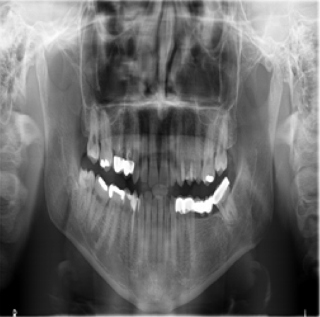
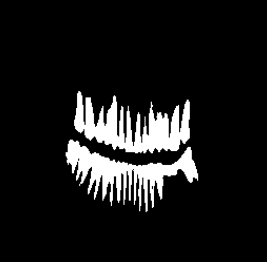

# Dental Image Segmentation with Semi-Supervised Learning


## Overview

This repository contains the code and resources for the study on dental image segmentation using advanced deep learning models, with a focus on leveraging semi-supervised learning to enhance performance. The models were developed to accurately identify and enumerate teeth in panoramic X-ray images, making them suitable for automated dental diagnostics.

## Table of Contents

- [Overview](#overview)
- [Features](#features)
- [Dataset](#dataset)
- [Installation](#installation)
- [Models](#models)
- [Results](#results)

## Features

- **Advanced Segmentation Models**: Includes implementations of U-Net, ResUNet, Attention ResUNet, Swin-UNet, ViT, and TransUNet.
- **Semi-Supervised Learning**: Utilizes pseudo-labeling on the unlabelled DenteX dataset to improve model performance.
- **Comprehensive Evaluation**: Evaluates models using metrics such as F1 Score, Accuracy, Dice Score, Precision, Recall, and Intersection over Union (IoU).
- **Post-Processing Techniques**: Includes watershedding and erosion techniques for enhanced tooth counting.

## Dataset

### Tufts Labeled Dental Dataset
- A publicly available dataset consisting of panoramic X-ray images with labeled dental structures.
  
### DenteX Challenge Dataset
- An unlabelled dataset used for semi-supervised learning to improve model robustness.

## Installation

1. Clone the repository:
   ```bash
   git clone https://cseegit.essex.ac.uk/22-24-ce901-ce911-cf981-su/22-24_CE901-CE911-CF981-SU_syed_mohammad_u.git
   cd 22-24_CE901-CE911-CF981-SU_syed_mohammad_u

## Models
- U-Net: Baseline model known for its encoder-decoder architecture with skip connections.
- ResUNet: A U-Net variant incorporating residual connections for deeper networks.
- Attention ResUNet: Integrates attention mechanisms to focus on critical regions of the image.
- Swin-UNet: Uses Swin Transformer blocks to capture both global and local image features.
- Vision Transformer (ViT): Treats image patches as sequences, leveraging transformer architecture for segmentation.
- TransUNet: Combines CNN features with transformers for robust segmentation.

## Results

### Evaluation Metrics

The models were evaluated on the Tufts dataset before and after applying semi-supervised learning with the DenteX dataset. Key metrics include F1 Score, Accuracy, Dice Score, Precision, Recall, and Intersection over Union (IoU).

| Model                         | F1 Score | Accuracy | Dice Score | Precision | Recall | IoU   |
|-------------------------------|----------|----------|------------|-----------|--------|-------|
| U-Net                         | 0.9161   | 0.9778   | 0.9161     | 0.8880    | 0.9460 | 0.8452|
| U-Net + SSL                   | 0.9138   | 0.9793   | 0.9138     | 0.8751    | 0.9561 | 0.8413|
| ResUNet                       | 0.9086   | 0.9754   | 0.9086     | 0.8662    | 0.9552 | 0.8324|
| ResUNet + SSL                 | 0.9124   | 0.9816   | 0.9124     | 0.8767    | 0.9512 | 0.8390|
| Attention ResUNet             | 0.9070   | 0.9753   | 0.9077     | 0.8681    | 0.9510 | 0.8309|
| Attention ResUNet + SSL       | 0.9125   | 0.9816   | 0.9125     | 0.8764    | 0.9516 | 0.8391|

### Output
#### Input Image


#### Output Image

